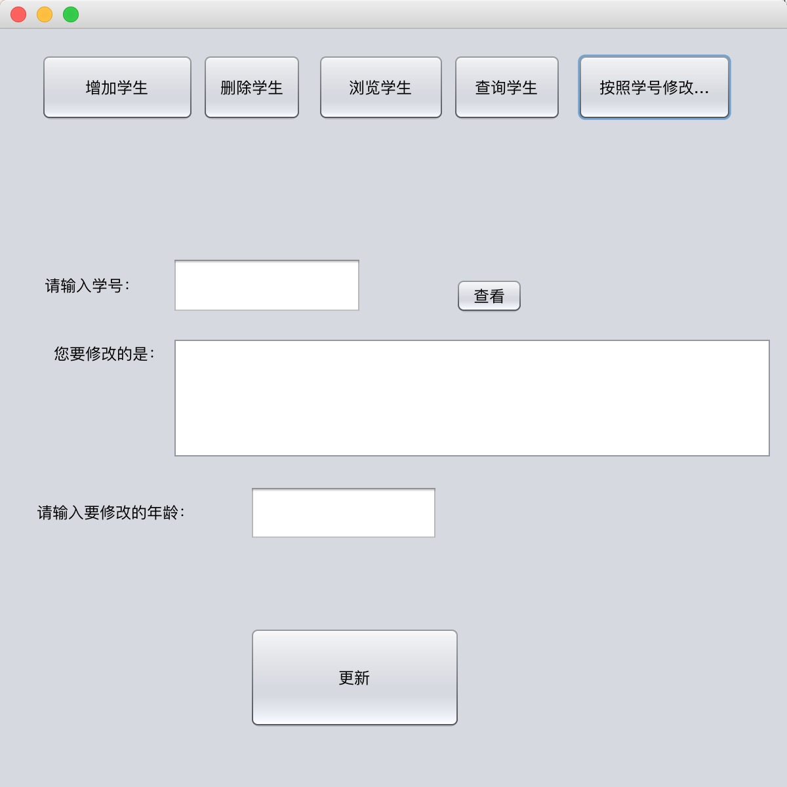

#数据库系统概论课程笔记
##第三次上机  `数据库大作业` 
==已经于6月6日上机课交于老师检查==

使用`MySQL5.7 + Java`实现, 使用`MVC框架`进行开发

为了简化操作，找到适合自己的关系模式，我只用了一个student关系存储数据

其中：`reward为可空`。
###在数据库中建立student表：

```sql
CREATE TABLE `students` (
  `num` varchar(30) NOT NULL,
  `name` varchar(10) NOT NULL DEFAULT '',
  `sex` enum('男','女') DEFAULT NULL,
  `age` int(11) NOT NULL,
  `major` varchar(10) NOT NULL,
  `reward` varchar(30) DEFAULT NULL,
  PRIMARY KEY (`num`)
) ENGINE=InnoDB DEFAULT CHARSET=utf8;
```
####性别约束使用枚举类型：

####年龄约束使用触发器：

>一个合理的操作过程是在数据库操作的时候发生SQL异常，并在Java程序中将SQl异常捕获，并进行处理。

###使用JDBC连接数据库，将获得数据库连接操作封装成类：

```java
package db;

import java.sql.Connection;
import java.sql.DriverManager;
import java.sql.SQLException;

public class DBConnent {
    private static final String URL="jdbc:mysql://127.0.0.1:3306/test3?useSSL=false";
	private static final String USER="root";
	private static final String PASSWORD="lcl123";
	
	private static Connection conn=null;
	
	static {
		try {
			//1.加载驱动程序
			Class.forName("com.mysql.jdbc.Driver");
			//2.获得数据库的连接
			conn=DriverManager.getConnection(URL, USER, PASSWORD);
		} catch (ClassNotFoundException e) {
			e.printStackTrace();
		} catch (SQLException e) {
			e.printStackTrace();
		}
	}
	
	public static Connection getConnection(){
		return conn;
	}
}
```
###Mode层，对数据库内容映射，并重写toString方法：

```java
package model;


public class Student {
    private String num;
    private String name;
    private String sex;
    private int age;
    private String major;
    private String reward;

    public String getNum() {
        return num;
    }

    public void setNum(String num) {
        this.num = num;
    }

    public String getName() {
        return name;
    }

    public void setName(String name) {
        this.name = name;
    }

    public String getSex() {
        return sex;
    }

    public void setSex(String sex) {
        this.sex = sex;
    }

    public int getAge() {
        return age;
    }

    public void setAge(int age) {
        this.age = age;
    }

    public String getMajor() {
        return major;
    }

    public void setMajor(String major) {
        this.major = major;
    }

    public String getReward() {
        return reward;
    }

    public void setReward(String reward) {
        this.reward = reward;
    }    
    
    @Override
    public String toString(){  
        return "学号: "+getNum()+"\t"+"姓名: "+getName()+"\t"+"性别: "+getSex()+
                "\t"+"年龄: "+getAge()+"\t"+"专业: "+getMajor()+"\t"+"奖励: "+getReward();  
    }  
}

```
###DAO层，封装对数据库student表的操作 `增``删``改``查`:

```java
package dao;

import db.DBConnent;
import java.sql.Connection;
import java.sql.PreparedStatement;
import java.sql.ResultSet;
import java.sql.SQLException;
import java.util.ArrayList;
import java.util.List;
import java.util.Map;
import model.Student;

public class StudentDao {
    /**
     * 向数据库增加一个学生类型
     * @param s 一个学生
     * @throws Exception 
     */
    public void addStudent(Student s) throws Exception{
		Connection conn=DBConnent.getConnection();
		String sql="" +
				"insert into students" +
				"(num,name,sex,age,major,reward)" +			
				"values(" +
				"?,?,?,?,?,?)";
		PreparedStatement ptmt=conn.prepareStatement(sql);
		//预处理，用？占位
		ptmt.setString(1,s.getNum());
		ptmt.setString(2, s.getName());
		ptmt.setString(3, s.getSex());
		ptmt.setInt(4, s.getAge());
		ptmt.setString(5, s.getMajor());
		ptmt.setString(6, s.getReward());//这里可能出问题	
		ptmt.executeUpdate();
	}
	
	public void updateStudent(Student s) throws SQLException{
		Connection conn=DBConnent.getConnection();
		String sql="" +
				" update students " +
				" set name=?,sex=?,age=?,major=?,reward=?" +
				" where num=? ";
		PreparedStatement ptmt=conn.prepareStatement(sql);
		//预处理，用？占位
		ptmt.setString(6,s.getNum());
		ptmt.setString(1, s.getName());
		ptmt.setString(2, s.getSex());
		ptmt.setInt(3, s.getAge());
		ptmt.setString(4, s.getMajor());
		ptmt.setString(5, s.getReward());//这里可能出问题		
		ptmt.execute();
	}
	
	public void delStudent(String num) throws SQLException{
		Connection conn=DBConnent.getConnection();
		String sql="" +
				" delete from students " +
				" where num=? ";
		PreparedStatement ptmt=conn.prepareStatement(sql);
                
		ptmt.setString(1, num);
		ptmt.execute();
	}
        /**
         * 查询全部学生的全部信息
         * @return
         * @throws Exception 
         */
	public List<Student> query() throws Exception{
		List<Student> result=new ArrayList<Student>();
		
		Connection conn=DBConnent.getConnection();
		StringBuilder sb=new StringBuilder();
		sb.append("select num,name,sex,age,major,reward from students");
		
		PreparedStatement ptmt=conn.prepareStatement(sb.toString());
		
		ResultSet rs=ptmt.executeQuery();
		
		Student g=null;
		while(rs.next()){
			g=new Student();
			g.setNum(rs.getString("num"));
			g.setName(rs.getString("name"));
                        g.setSex(rs.getString("sex"));
			g.setAge(rs.getInt("age"));
                        g.setMajor(rs.getString("major"));
			g.setReward(rs.getString("reward"));			
			result.add(g);
		}
		return result;
	}
        /**
         * 按照某些属性查找n条元组
         * @param params 要查询的属性
         * @return
         * @throws Exception 
         */
        public List<Student> query(List<Map<String, Object>> params) throws Exception{
		List<Student> result=new ArrayList<>();
		
		Connection conn=DBConnent.getConnection();
		StringBuilder sb=new StringBuilder();
		sb.append("select * from students where 1=1 ");
		
		if(params!=null&&params.size()>0){
			for (int i = 0; i < params.size(); i++) {
				Map<String, Object> map=params.get(i);
				sb.append(" and  ").append(map.get("name")).append(" ").append(map.get("rela")).append(" ").append(map.get("value")).append(" ");
			}
		}
		
		PreparedStatement ptmt=conn.prepareStatement(sb.toString());
		
		ResultSet rs=ptmt.executeQuery();
		
		Student g=null;
		while(rs.next()){
			g=new Student();
			g.setNum(rs.getString("num"));
			g.setName(rs.getString("name"));
                        g.setSex(rs.getString("sex"));
			g.setAge(rs.getInt("age"));
                        g.setMajor(rs.getString("major"));
			g.setReward(rs.getString("reward"));			
			result.add(g);
		}
		return result;
	}
        
}
```
###Controller层，将前台操作封装：

```java
package action;

import dao.StudentDao;
import java.sql.SQLException;
import java.util.ArrayList;
import java.util.HashMap;
import java.util.List;
import java.util.Map;
import model.Student;

public class StudentAction {

    public void add(Student s) throws Exception {
        StudentDao dao = new StudentDao();
        dao.addStudent(s);
    }

    public void edit(Student s) throws Exception {
        StudentDao dao = new StudentDao();
        dao.updateStudent(s);
    }
    /**
     * 判断是否有某个学号为num的学生
     * @param num 该学生的学号
     * @return 有返回true，没有返回false
     * @throws Exception 
     */
    public boolean isNum(String num) throws Exception{
        List<Map<String, Object>> params = new ArrayList<>();
        Map<String, Object> map = new HashMap<>();

        map.put("name", "num");
        map.put("rela", "=");
        map.put("value", "'"+num+"'");

        params.add(map);
        StudentDao dao = new StudentDao();
        return !dao.query(params).isEmpty();
    }
    
    public void editAgeByNum(String num,Integer age) throws Exception {   
        Student student=searchByNum(num).get(0);
        student.setAge(age);
        edit(student);        
    }

    /**
     * 按学号删除
     *
     * @param num 想删除的学生学号
     * @throws SQLException
     */
    public void del(String num) throws SQLException {
        StudentDao dao = new StudentDao();
        dao.delStudent(num);
    }

    /**
     * 查询全部学生信息
     *
     * @return
     * @throws Exception
     */
    public List<Student> query() throws Exception {
        StudentDao dao = new StudentDao();
        return dao.query();
    }
    /**
     * 按照学号查找学生
     * @param num
     * @return
     * @throws Exception 
     */
    public List<Student> searchByNum(String num) throws Exception {
        List<Map<String, Object>> params = new ArrayList<Map<String, Object>>();

        Map<String, Object> map = new HashMap<String, Object>();

        map.put("name", "num");
        map.put("rela", "=");
        map.put("value", "'"+num+"'");

        params.add(map);
        StudentDao dao = new StudentDao();
        return dao.query(params);
    }
    
    /**
     * 按照姓名查找学生
     * @param name
     * @return
     * @throws Exception
     */
    public List<Student> searchByName(String name) throws Exception {
        List<Map<String, Object>> params = new ArrayList<Map<String, Object>>();

        Map<String, Object> map = new HashMap<String, Object>();

        map.put("name", "name");
        map.put("rela", "=");
        map.put("value", "'"+name+"'");

        params.add(map);
        StudentDao dao = new StudentDao();
        return dao.query(params);
    }

    /**
     * 按照年龄查找学生
     * @param age
     * @return
     * @throws Exception
     */
    public List<Student> searchByAge(Integer age) throws Exception {
        List<Map<String, Object>> params = new ArrayList<>();
        Map<String, Object> map = new HashMap<>();

        map.put("name", "age");
        map.put("rela", "=");
        map.put("value", age);

        params.add(map);
        StudentDao dao = new StudentDao();
        return dao.query(params);
    }
}
```
###View层利用Java.Swing开发，代码重复较多，不予以展示
可以点击链接访问Github查看[https://github.com/Zlatanlong/dblearning](https://github.com/Zlatanlong/dblearning)
###使用操作
主界面有**5**个功能：

* 增加学生
* 删除学生
* 浏览学生
* 查询学生
* 按照学生修改

####浏览学生：点击后直接能查看学生信息

####增加学生：点击后直接能查看学生信息


以上为三种==错误==演示！
以下为添加成功操作，点击浏览即可看到！


数据库中也可以查询到：

###删除学生：
####较为人性化的添加了一个查看功能，如果没有该学号则显示**没找到！**，否则显示学生信息。


####浏览检查，并在数据库中查看，确定已经删除


###查询学生
####如果没有该信息的学生，则显示没找到！

####有则显示结果


###按照学生学号修改学生年龄
####该功能相当于查询和更新操作，若没找到学号也会显示“没找到！”，与之前相似，不给予展示，展示成功操作截图：


####在浏览和数据库中确认功能：


###大作业全部功能均完成！
##第四次上机  2018-5-23
要求：用**`SQL语言`**完成第五版书上P130页作业4，5和9题

* 创建了四个表
* 对表进行了`增``删``改``查`等一系列操作
* 用SQL Server 2005 和 MySQL 5.7 两种数据库都进行了操作，若不加以说明，下面展示的是均为MySQL的代码

###新建Supplier表并插入数据
~~~sql
create table Supplier
(sno char(2)primary key,
sname char(20),
status smallint,
city char(10)
);

insert into Supplier(sno,sname,status,city)
values('S1','精益',20,'天津');
insert into Supplier(sno,sname,status,city)
values('S2','盛锡',10,'北京');
insert into Supplier(sno,sname,status,city)
values('S3','东方红',30,'北京');
insert into Supplier(sno,sname,status,city)
values('S4','丰泰盛',20,'天津');
insert into Supplier(sno,sname,status,city)
values('S5','为民',30,'上海');
~~~
###新建Parts表并插入数据
```sql
create table Parts
(pno char(2) primary key,
pname char(20),
color char(2),
weight smallint
);

insert into Parts(pno,pname,color,weight)
values('P1','螺母','红','12');
insert into Parts(pno,pname,color,weight)
values('P2','螺栓','绿','17');
insert into Parts(pno,pname,color,weight)
values('P3','螺丝刀','蓝','14');
insert into Parts(pno,pname,color,weight)
values('P4','螺丝刀','红','14');
insert into Parts(pno,pname,color,weight)
values('P5','凸轮','蓝','40');
insert into Parts(pno,pname,color,weight)
values('P6','齿轮','红','30');
```
###新建Jtable表并插入数据
```sql
create table Jtable
(jno char(2) primary key,
jname char(20),
city char(10)
);

insert into Jtable(jno,jname,city)
values('J1','三建','北京');
insert into Jtable(jno,jname,city)
values('J2','一汽','长春');
insert into Jtable(jno,jname,city)
values('J3','弹簧厂','天津');
insert into Jtable(jno,jname,city)
values('J4','造船厂','天津');
insert into Jtable(jno,jname,city)
values('J5','机车厂','唐山');
insert into Jtable(jno,jname,city)
values('J6','无线电厂','常州');
insert into Jtable(jno,jname,city)
values('J7','半导体厂','南京');
```
###新建SPJ表并插入数据
```sql
create table SPJ
(sno char(2),
pno char(2),
jno char(2),
qty int,
primary key(sno,pno,jno),
foreign key(sno) references Supplier(sno),
foreign key(pno) references Parts(pno),
foreign key(jno) references Jtable(jno)
);

insert into SPJ(sno,pno,jno,qty)
values('S1','P1','J1',200);
insert into SPJ(sno,pno,jno,qty)
values('S1','P1','J3',100);
insert into SPJ(sno,pno,jno,qty)
values('S1','P1','J4',700);
insert into SPJ(sno,pno,jno,qty)
values('S1','P2','J2',100);
insert into SPJ(sno,pno,jno,qty)
values('S2','P3','J1',400);
insert into SPJ(sno,pno,jno,qty)
values('S2','P3','J2',200);
insert into SPJ(sno,pno,jno,qty)
values('S2','P3','J4',500);
insert into SPJ(sno,pno,jno,qty)
values('S2','P3','J5',400);
insert into SPJ(sno,pno,jno,qty)
values('S2','P5','J1',400);
insert into SPJ(sno,pno,jno,qty)
values('S2','P5','J2',100);
insert into SPJ(sno,pno,jno,qty)
values('S3','P1','J1',200);
insert into SPJ(sno,pno,jno,qty)
values('S3','P3','J1',200);
insert into SPJ(sno,pno,jno,qty)
values('S4','P5','J1',100);
insert into SPJ(sno,pno,jno,qty)
values('S4','P6','J3',300);
insert into SPJ(sno,pno,jno,qty)
values('S4','P6','J4',200);
insert into SPJ(sno,pno,jno,qty)
values('S5','P2','J4',100);
insert into SPJ(sno,pno,jno,qty)
values('S5','P3','J1',200);
insert into SPJ(sno,pno,jno,qty)
values('S5','P6','J2',200);
insert into SPJ(sno,pno,jno,qty)
values('S5','P6','J4',500);
```

###第四题：
4.1

```sql
select distinct sno From spj Where jno='j1';
```

 sno |
-----
| S1  |
| S2  |
| S3  |
| S4  |
| S5  |
4.2

```sql
select distinct sno From spj Where jno='j1' and pno='p1';
```
 sno |
-----
| S1  |
| S3  |
4.3

```sql
 select distinct sno From spj,parts Where jno='j1' 
 and spj.pno=parts.pno and color='红';
```
 sno |
-----
| S1  |
| S3  |
4.4

```sql
select distinct jno From jtable 
Where  jno not in(
select jno from spj,parts,supplier 
where city='天津' and color='红' 
and spj.pno=parts.pno and spj.sno=supplier.sno);
```
jno |
-----
| J2  |
| J5  |
| J6  |
| J7  |
-
### 第五题
##### 5.1

```sql
select sname,city from supplier;
```
sname     | city   |
---|----
| 精益      | 天津   |
| 盛锡      | 北京   |
| 东方红    | 北京   |
| 丰泰盛    | 天津   |
| 为民      | 上海   |
##### 5.2

```sql
select distinct pname,color,weight from parts;
```
pname     | color | weight |
-----------+-------+--------+
| 螺母      | 红    |     12 |
| 螺栓      | 绿    |     17 |
| 螺丝刀    | 蓝    |     14 |
| 螺丝刀    | 红    |     14 |
| 凸轮      | 蓝    |     40 |
| 齿轮      | 红    |     30 |
##### 5.3

```sql
select distinct jno from spj where sno='s1';
```
jno |
-----+
| J1  |
| J3  |
| J4  |
| J2  |
##### 5.4

```sql
select pname,qty from spj,parts where spj.pno=parts.pno 
and jno='j2';
```
pname     | qty  |
-----------+------+
| 螺栓      |  100 |
| 螺丝刀    |  200 |
| 凸轮      |  100 |
| 齿轮      |  200 |
##### 5.5

```sql
select distinct pno from spj,supplier
where spj.sno=supplier.sno and city='上海';
```
pno |
-----+
| P2  |
| P3  |
| P6  |
##### 5.6

```sql
select distinct jname from spj,jtable,supplier
where spj.jno=jtable.jno 
and spj.sno=supplier.sno and supplier.city='上海';
```
 jname     |
-----------+
| 造船厂    |
| 三建      |
| 一汽      |
##### 5.7

```sql
select distinct jno from jtable 
where jno not in(
select distinct spj.jno from spj,jtable,supplier
where spj.jno=jtable.jno and spj.sno=supplier.sno 
and supplier.city='天津');
```
jno |
-----+
| J5  |
| J6  |
| J7  |
##### 5.8

```sql
update parts set color='红' where color='蓝';
```
##### 5.9

```sql
update spj set sno='s3' where sno='s5' and jno='j4' and pno='p6';
```
##### 5.10

```sql
delete from supplier where sno='s2';
delete from spj where sno='s2';
```
##### 5.11

```sql
insert into spj(sno,jno,pno,qty)values('s2','j6','p4',200);
```


## 第五六次上机  2018-5-30 / 2018-6-4
* 第五次实验完成的是关于==视图==的操作，将第四次实验剩下的关于视图操作的第四章第九题完成，还有==用户操作==的一部分

* 第六次实验学习了关于==函数==的使用，写出了一些==触发器==的操作

### 第九题
* 创建视图

	```sql
	create view vsp as select sno,pno,qty from spj,jtable
	where spj.jno=jtable.jno and jtable.jname='三建';
	```
	
9.1	
	
```sql
select distinct pno,sum(qty) from vsp group by pno;
```
pno | sum(qty) |
-----+----------+
| P1  |      400 |
| P3  |      800 |
| P5  |      500 |
9.2

```sql
select distinct *from vsp where sno='s1';
```
sno | pno | qty  |
-----+-----+------+
| S1  | P1  |  200 |
-
###视图练习：
建立`学生`,`课程`,`选课关系`三张表格并插入数据：

```sql
create table student(
	sno varchar(20) primary key,
	sname varchar(20),
	sex enum('男','女'),
	sage int,
	sdept varchar(10)
);

create table course(
	cno varchar(5) primary key,
	cname varchar(20),
	cpno varchar(5),
	ccredit INT
);

create table sc(
    sno varchar(20),
    cno varchar(5),
    grade int,
    primary key(sno,cno),
    foreign key (sno) references student(sno),
    foreign key (cno) references course (cno)
);

alter table student change column sex ssex enum('男','女'); 

insert into student(sno,sname,ssex,sage,sdept) 
values('201215121','李勇','男',20,'CS'),
('201215122','刘晨','女',19,'CS'),
('201215123','王敏','女',18,'MA'),
('201215125','张立','男',19,'IS');

insert into course(cno,cname,cpno,ccredit) 
values('1','数据库','5',4),
('2','数学','',2),
('3','信息系统','1',4),
('4','操作系统','6',3),
('5','数据结构','7',4),
('6','数据处理','',2),
('7','PASCAL语言','6',4);

insert into sc(sno,cno,grade) 
values('201215121','1',92),
('201215121','2',85),
('201215121','3',88),
('201215122','2',90),
('201215122','3',80);
```
 
>修改一列（以此题为例，第25行）：
>
>alter table student change column sex ssex enum('男','女'); 

建立1号课程的选课关系is_sc1，并要求通过该视图进行的更新操作只涉及1号课程，同时对该视图的任何操作只能在工作时间（周一 — 周五的9点至17点）进行：

```sql
create view is_sc1 as 
select cno,sno,grade 
from sc 
where cno='1'  
and  (date_format(now(),'%d') between 9 and 17)
and  (WEEKDAY(now()) in(0,1,2,3,4))
with check option;

-- 不带with check option;
create view is_sc2 as 
select cno,sno,grade 
from sc 
where cno='1'  
and  (date_format(now(),'%d') between 9 and 17)
and  (WEEKDAY(now()) in(0,1,2,3,4));
```
>now()  获得当前时间函数；
>
>date_format(now(),'%Y%m%d%H%i%s') 按格式获取时间（年月日时分秒）
>
>WEEKDAY(now()) 获取当前星期 0为星期一 6为星期天

####创建用户  	
mysql中创建用户

```sql
create user '张勇'@localhost identified by '*********';
create user '李天明'@localhost identified by '*********';
grant insert on test4. supplier to 张勇@'localhost' WITH GRANT OPTION;
grant select on test4.spj to 李天明@localhost;
grant update(QTY) on spj.spj to 李天明@localhost;
mysql -u 张勇 –p

select * from s;
ERROR 1142 (42000): SELECT command denied to user '张勇'@'localhost' for table 's'
```
*SQL Server中实现* 

```sql
create login lcl with password='123'
create user LCL for login lcl with default_schema=dbo
grant select on sc to LCL
select* from sc

SELECT GETDATE() AS CurrentDateTime
```

-
###触发器操作
在MySQL中，创建触发器语法如下：

```sql
CREATE TRIGGER trigger_name
trigger_time
trigger_event ON tbl_name
FOR EACH ROW
trigger_stmt
```
其中：

trigger_name：标识触发器名称，用户自行指定；

trigger_time：标识触发时机，取值为 BEFORE 或 AFTER；

trigger_event：标识触发事件，取值为 INSERT、UPDATE 或 DELETE；

`tbl_name`：标识建立触发器的表名，即在哪张表上建立触发器；
trigger_stmt：触发器程序体，可以是一句SQL语句，或者用 BEGIN 和 END 包含的多条语句。

由此可见，可以建立6种触发器，即：BEFORE INSERT、BEFORE UPDATE、BEFORE DELETE、AFTER INSERT、AFTER UPDATE、AFTER DELETE。

另外有一个限制是不能同时在一个表上建立2个相同类型的触发器，因此在一个表上最多建立6个触发器。
####BEGIN … END 详解
在MySQL中，BEGIN … END 语句的语法为：

```sql
BEGIN
[statement_list]
END
```
其中，`statement_list` 代表一个或多个语句的列表，列表内的每条语句都必须用分号（;）来结尾。
而在MySQL中，分号是语句结束的标识符，遇到分号表示该段语句已经结束，MySQL可以开始执行了。因此，解释器遇到`statement_list` 中的分号后就开始执行，然后会报出错误，因为没有找到和 BEGIN 匹配的 END。

这时就会用到 ==DELIMITER== 命令（DELIMITER 是定界符，分隔符的意思），它是一条命令，不需要语句结束标识，语法为：
`DELIMITER new_delemiter
new_delemiter` 可以设为1个或多个长度的符号，默认的是分号（;），我们可以把它修改为其他符号，如 &：DELIMITER & 在这之后的语句，以分号结束，解释器不会有什么反应，只有遇到了&，才认为是语句结束。注意，使用完之后，我们还应该记得把它给修改回来。

-
###触发器例题：
在学生选课表SC上创建一个触发器trigger_student1,该触发器被insert操作触发，当用户向SC表插入一条新记录时，判断该记录的学号在学生基本信息表S中是否存在，如果存在则插入成功，否则插入失败。

```sql
DELIMITER $
create trigger trigger_student1 before insert
on sc for each row
if(new.sno not in
(select sno from student))
then
SIGNAL SQLSTATE '45000'
SET MESSAGE_TEXT = "学号输入不正确" ;
end if
$
DELIMITER ;
```

在学生基本信息表Student上创建一个触发器Trigger_student3，该触发器被Update操作触发，当用户在Student表中修改一条学生记录的学号时，同时自动更新学生选课表SC中相应的学号。

```sql
create trigger trigger_student3 before update
on student for each row
update sc 
    set sno = new.sno
    where sc.sno = old.sno;
```
##第七次上机 2018-6-13
T-SQL练习：本次上机先进行了T-SQL练习，*T-SQL是SQL Server的核心内容*，相关代码均为在SQL Server 2005中实现。

* 学生选课数据库中，如果数据库课程的成绩高于75分，则显示信息“平均成绩高于75分”

```sql
declare @avg_db float
select @avg_db=avg(Grade)
from SC,Course
where Course.Cno=SC.Cno and Cname='数据库'
print '数据库课程平均分为'+convert(varchar(5),@avg_db)
if(@avg_db>75)
	begin 
		print '平均成绩高于75分'
	end

```
*  如果3号课程的平均成绩低于60，那么显示“不及格”；如果高于90，则显示“优秀”；其他显示“合格”。

```sql
declare @avg_cno3 float
select @avg_cno3=avg(Grade)
from SC
where Cno='3'
print '3号课程的平均分为'+convert(varchar(5),@avg_cno3)
if(@avg_cno3>90)
	begin 
		print '优秀'
	end
if(@avg_cno3<60)
	begin 
		print '不及格'
	end
else
	begin
		print '合格'
	end

```

* 根据如下规则对考试成绩进行反复加分，直到平均分超过85分为止。请编写T-SQL语句实现。

	90分以上：   不加分
	
	80－89分：   加1分
	
	70－79分：   加2分
	
	60－69分：   加3分
	
	60分以下：   加5分

```sql
declare @avg_grade float
select @avg_grade=avg(Grade)
from SC
while(1=1)
	begin 
		update SC
			set Grade=
				case 
					when Grade<60 then Grade+5
					when Grade>60 and Grade<70 then Grade+3
					when Grade>70 and Grade<80 then Grade+2
					when Grade>80 and Grade<90 then Grade+1
					else Grade
				end
		if(@avg_grade>85)
				break
	end

```


* 创建存储过程`Proc_1`，实现：查询学分为4的课程学生选课情况列表，其中包括学号、姓名、性别、课程号、学分、所在系。调用过程`Proc_1`查看执行结果。

```sql
go
create proc proc_1
As
 Select Student.Sno,Student.Sname,Student.Ssex,Course.Cno,
 Course.Ccredit,Student.Sdept from Student,Course,SC
   Where SC.Sno=Student.Sno and SC.Cno=Course.Cno 
   and Course.Ccredit=4;
Exec proc_1;
```
* 创建存储过程Proc_2，比较两个学生的选课平均分，若前者高就输出0，否则输出1.执行该存储过程，并查看结果。

```sql
go
Create Proc proc_2
(@sno1 char(8),@sno2 char(8), @result int out)
As
  Begin 
    Declare @Avg1 float,@Avg2 Float
    Select @Avg1=AVG(Grade) from SC where Sno=@sno1
    Select @Avg2=AVG(Grade) from SC where Sno=@sno2
    if @Avg1>@Avg2
      set @result=0
    else
      set @result=1
  end
 go 
```
* 创建一个触发器sex_control，当插入或更新学生的基本资料时，
该触发器检查指定修改或插入的记录的性别是否只是男或女。若不是，则给出错误信息。

```sql
if exists (select name from sysobjects where name='sex_control' 
and type='TR')
   drop trigger sex_control
go
create trigger sex_control
on Student2
for insert, update
As
 declare @ssex char(2)
 select @ssex = Student.ssex from Student,inserted 
 where student.sno=inserted.sno  --查询被修改的记录的性别
 if not ((rtrim(@ssex)='男') or (rtrim(@ssex)='女'))
 begin
   raiserror('性别只能是男或女！不能是%s',16,1,@ssex)
   rollback transaction
 end
 go
 update Student2 set Ssex='好' where Sno='2014001'--激活触发器
```
Mysql 中代码：(before insert 操作，更新操作与其相同）

```sql
DELIMITER $
create trigger sex_control before insert
on student for each row
if(new.ssex not in
('男','女'))
then
SIGNAL SQLSTATE '45000'
SET MESSAGE_TEXT = "性别输入不正确" ;
end if
$
DELIMITER ;
```
* 创建触发器Stu_insert, 当向student表中添加一条学生信息时，则触发向SC表增加一条记录。学号为新增学号，课程号为1。

```sql
create trigger stu_insert after insert 
on student for each row
insert into sc(sno,cno)values(new.sno,'1');
```